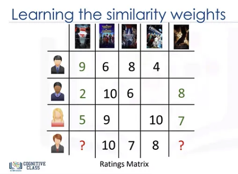
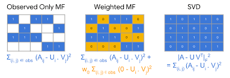

## Collaborative Filtering
- Memory Based Approach
    - User-based Filtering
    - Item-based Filtering

- Model Based Approach
    - 행렬 분해(Matrix Factorization)

> 1. 성향이 비슷한 친구가 본 영화를 찾아 본다 -> **협업 필터링(Collaborative Filtering)**
> 2. 내가 좋아하는 감독, 장르 등의 영화를 찾아본다. -> **Content Based Filtering**

\* **사용자의 과거 경험과 행동 방식**에 의존
 
#### [ 한계점 ]
- Cold Start Problem 
새로운 유저나 아이템의 등장 시, 기존의 관련 데이터(행동 방식 혹은 경험)가 없기 때문에 추천을 하지 못한다.

- Long Tail  
인기 있는 아이템이 소수로 구성되어 있어 데이터가 '비대칭적으로 쏠림 현상'이 발생하는 문제다.

- 계산 효율 저하  
계산량이 많은 알고리즘으로, 사용자가 증가할 수록 계산이 늘어나 효율이 저하되는 문제다.

---
## 1) Memory-Base Approach
Item들 간의 혹은 User들 간의 관계를 계산하는 방식으로 User가 아직 평가하지 않은 Item을 예측하고자 한다.

- 특징 : 최적화 방법 혹은 매개변수를 학습하지 않음. 단순 산술 연산 사용.
- 방법 : Cosine Similarity, Pearson Correlation, Knn 등.

- 장점
    - User와 Item을 직접적으로 연관시키고 추천하기 때문에 설명력이 높고 적용이 용의.
- 단점
    - sparse한 data인 경우 성능 저하.
    - 추천 결과를 생성할 때마다 많은 연산량을 요구 -> 확장성 낮음.

### 1.1) Item-based Filtering (아이템 기반의 근접 이웃 ) 
- 동일한 User의 이웃 Item의 점수를 기반으로 해당 Item에 대한 User의 사용자의 선호도 평가.
- 이미 평가했거나 상호작용한 User를 대상으로 하는 Item과 유사한 Item을 찾는 방법.

예시)
1. 특정 Item을 좋아하는 User들을 찾음.
2. 그 User들이 **공통적**으로 좋아했던 다른 Item을 찾음.  

### 1.2) User-based Filtering

예시)
1. Item에 대해 나와 유사하게 점수를 매긴 다른 User들을 찾음.
2. 유사한 User가 좋아했던 Item을 추천. 

### 1.3) 유사도 측정 방법

- Cosine Similarity
    - User $u$와 User $u'$가 같은 방향을 보고 있는지 평가
    - 거리는 고려하지 않고 방향만 고려

$$sim(u, u') = cos(\theta) =  \frac{R_{u} \cdot R_{u'}}{\left \| R_{u} \right \|\left \| R_{u'} \right \|} = \frac{\sum_{i=1}^{n}R_{ui}\times R_{u'i}}{\sqrt{\sum_{i=1}^{n}(R_{ui})^{2}} \times \sqrt{\sum_{i=1}^{n}(R_{u'i})^{2}}}$$

 

- Pearson Correlation Similarity
    - 평균적인 경향에서 얼마나 차이가 나는지를 기반
    - 평균을 빼므로, User $u$와 User $u'$가 함께 사용한 item이 있어야함.
$$sim(u, u') = \frac{\sum_{i=1}^{n}(R_{ui} - \bar{R_{u}})( R_{u'i} -\bar{R_{u'}}  ) }{\sqrt{\sum_{i=1}^{n}(R_{ui} - \bar{R_{u}})^{2}} \times \sqrt{\sum_{i=1}^{n}(R_{u'i} - \bar{R_{u'}})^{2}}}$$
 

- Euclidean Similarity
$$ sim\left(u,u'\right)   = \sqrt {\sum _{i=1}^{n}  \left( u'_{i}-u_{i}\right)^2 } $$

 

### 1.3.1) 유사도 사용 방식
User-Based Filtering 기준 (Item-Based와의 차이는 유사도 측정에서만 차이)
#### 1. User-Item Matrix 구축

**목표 : 4번째 user가 아직 보지 않은 영화 평점을 예측하여 4번째 user에게 영화를 추천**
 

#### 2. User간의 유사도 계산

 

#### 3. Item의 평점 추론

> - ① 4번째 user가 보지 않은 영화들을 본 user의 평점을 추출
> - ② 4번째 user와의 `유사도` 계산
> - ③ 각 user 별 `유사도 x 평점` 계산
> $$sim(u,u') \times R_{u'i}$$
>
> - ④ 유사도가 반영된 `가중치 평점을 합산` 
> $$\sum_{u'}sim(u,u') \times R_{u'i}$$
>
> - ⑤ 가중치를 나누어 `평균 평점`을 계산하여, 4번째 user의 보지 않은 영화의 평점 추론
>
> $$\hat{R_{ui}} = \frac{\sum_{u'}sim(u,u') \times R_{u'i}}{\sum_{u'}\left | sim(u,u') \right | }$$

 

---

### 2) Model-Based Approach

기계 학습을 통해 추천
 
User-Item의 숨겨진 특성(feature)값을 계산하여 학습
- 특징 : 최적화 방법이나, 매개변수를 학습
- 방법 : Matrix Factorization(MF, 행렬 분해)
- 장점
    - 추천 할 때 학습한 모델만 있으면 된다.
    - 확장성과 예측 속도가 빠르다.
    - 적은 데이터에서도 잘 동작한다.

- 단점
    - 모델만을 가지고 추천하기에 예측 정확도가 떨어질 수 있다.
    - 첫 model을 학습 시 많은 시간과 연산량이 요구된다.

 

## Reference
- [추천 시스템 기본 - 협업 필터링(Collaborative Filtering) - ①](https://kmhana.tistory.com/31)
- [Collaborative Filtering](https://www.blossominkyung.com/recommendersystem/collaborative-filtering)